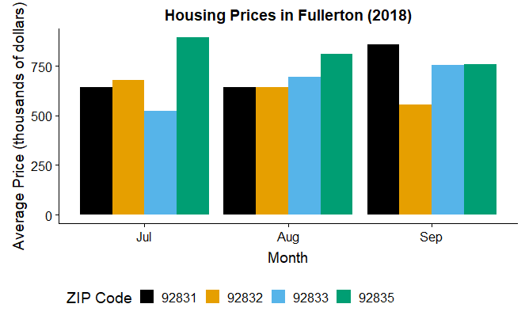
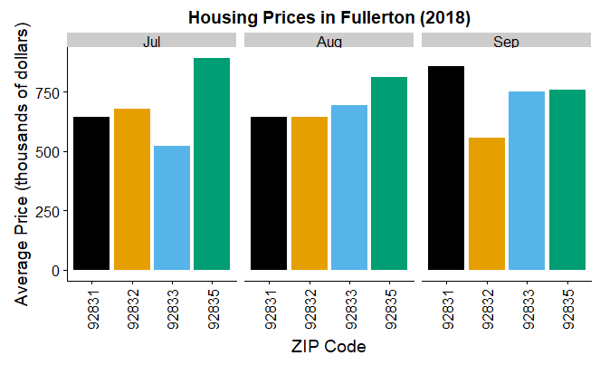
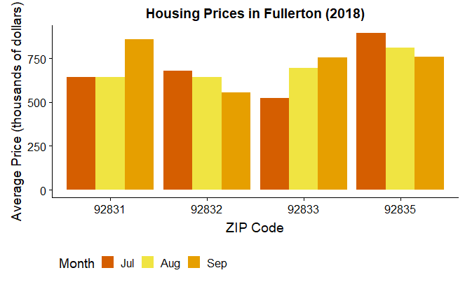
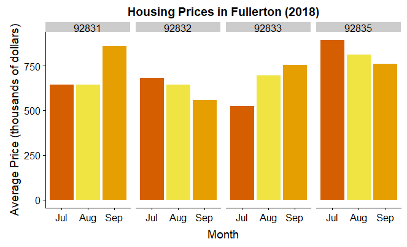
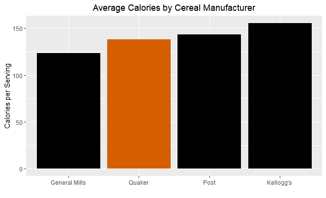
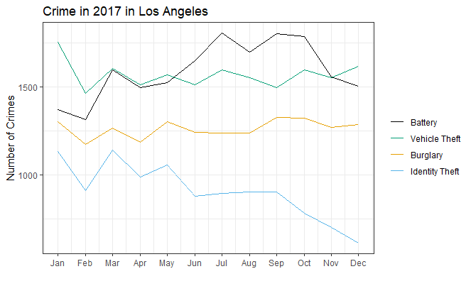

background-image: url(foxnews_piechart.png)

```{r setup, include=FALSE}
options(htmltools.dir.version = FALSE)
```

# Data Visualization is Hard!

.footnote[
https://flowingdata.com/2009/11/26/fox-news-makes-the-best-pie-chart-ever/
]

---
class: top, left

# Why Use R?

- "Excel still encourages people to produce bad graphs - in some respects more than in the past because it now offers even more dysfunctional choices."<sup>1</sup>


.footnote[
[1] Stephen Few, *Show Me the Numbers*
]

--

- R (with the ggplot2 package) gives you almost total control over every aspect of your graphs

--

- It's harder to do but easier to do *well*!


---

# Warm-Up Exercise

.pull-left[


]

.pull-right[


]
???

Four graphs showing the average home price in four ZIP codes in July-September 2019

1) Which of the four graphs is best for this purpose?
2) Is there a better way to display this information?
3) What information is NOT being shown here?

---
class: center, middle
# Overview

Tonight we will create the following graphs:



---
class: center, middle
# Overview

Tonight we will create the following graphs:




---

# Getting Started with R

- Open R Studio

- Open a new script: File $\rightarrow$ New File $\rightarrow$ R Script

--

- All of the work we do tonight will go in this script

---

# Getting Started with R

At the top of your script file, you want to load the R packages you are going to need:

```{r load ggplot2, warning=FALSE}
library(ggplot2) #<<
# Rest of code will go here
```


---

# Getting Started with R

Let's load the data first. We should see three datasets:

- cereal_calories
- housing
- lacrime2017

--

```{r load data, results = "hide", message = FALSE, warning = FALSE}
library(readr)
cereal <- read_csv("cereal_calories.csv")
housing <- read_csv("housing.csv")
crime <- read_csv("lacrime2017.csv")
```

- Click the `Import Dataset` button to import the data

- Select `From Text (readr)` if that option is available

- Find the file

- In the `Import Options` box, change the names as shown in the code above

---

# Graph Workflow with ggplot2

Start by setting up the graph:

```r 
* ggplot(data = dataset, 
*        mapping = aes(x = x-variable, y = y-variable))
```

--

Then indicate what type of graph to make, e.g.:

```r
* + geom_bar() # for a barplot
* + geom_line() # for a line graph
```

--

Then customize the graph, e.g.:

```r
* + labs() # add or change axis labels
* + theme() # customize elements of the plot
```
--

Save your graph after each step!

--

Once you're happy with your graph, `print` it

---

# Graph Workflow with ggplot2

When in doubt:

- What am I trying to customize?

- Search online for the function and argument that does it

- Add it to your workflow with `+`

---

# Bar Graphs

- Used to compare values between categories

- Most often, the number or proportion of observations in each category

- For BI purposes, often look at a summary value (such as average) in each category

---

# Bar Graphs

For counts, use `geom_bar()`:

```{r bargraph-setup, fig.show = "hide"}
zip_bargraph <- ggplot(data = housing, 
                       mapping = aes(x = as.factor(ZipCode))
                       ) + geom_bar() #<<
print(zip_bargraph)
```
```{r ref.label="bargraph-setup", echo = FALSE, fig.height=4}
```

---

# Bar Graphs

For numbers, use `geom_col()`:

```{r bargraph2-setup, fig.show = "hide"}
zip_bargraph2 <- ggplot(data = housing, 
                        mapping = aes(x = as.factor(ZipCode), y = Price)
                        ) + geom_col()  #<<
print(zip_bargraph2)
```

```{r ref.label="bargraph2-setup", echo = FALSE, fig.height=4}
```

---

# Example: Creating a Bar Graph

- Let's look at the average calories in cereal for each of the four companies in our dataset

- By default, if there are multiple values in the dataset, the graph will add them

- It's easiest to create a separate dataset that contains the averages:

--

```{r average cereal, message = FALSE, warning = FALSE}
library(dplyr)
cereal_averages <- cereal %>% 
  group_by(Manufacturer) %>%
  summarize(Calories = mean(Calories))
```

- If you can't run this code, import the cereal_averages.csv dataset

--

- If you want to know more about how this code works, come back December 5!

---

# Example: Creating a Bar Graph

Now let's set up our graph:

.pull-left[
```{r cereal-setup1, fig.show = "hide"}
cereal1 <- ggplot(cereal_averages, 
                  aes(x = Manufacturer, y = Calories)) + 
           geom_col()
print(cereal1)
```
]

.pull-right[
```{r ref.label="cereal-setup1", echo = FALSE}
```
]

---
# Example: Creating a Bar Graph

Let's fix a couple of things here.

First, let's change the code to add color.

.pull-left[
```{r cereal-setup2, fig.show = "hide"}
cereal1 <- ggplot(cereal_averages, 
                  aes(x = Manufacturer, y = Calories)) + 
geom_col(aes(fill = Manufacturer))  #<<
print(cereal1)
```

- Adding colors added a legend!

]

.pull-right[
```{r ref.label="cereal-setup2", echo = FALSE}
```
]

---
# Example: Creating a Bar Graph

Let's fix a couple of things here.

Next, let's reorder the bars.

.pull-left[
```{r cereal-setup3, fig.show = "hide"}
cereal1 <- ggplot(cereal_averages, 
                  aes(x = reorder(Manufacturer, Calories), #<<
                      y = Calories)) + 
geom_col(aes(fill = Manufacturer))
print(cereal1)
```

- The `reorder` command changes the bar order

]

.pull-right[
```{r ref.label="cereal-setup3", echo = FALSE}
```
]

---

# Example: Creating a Bar Graph

Once the plot is set up correctly, we can just add customization to the already saved plot!

Let's start by renaming axis labels:

.pull-left[
```{r cereal-labels, fig.show = "hide"}
cereal2 <- cereal1 + 
  labs(x = "", y = "Calories per Serving") #<<
print(cereal2)
```

]


.pull-right[
```{r ref.label="cereal-labels", echo = FALSE}
```
]

???

In general we want to label our axes. However, when the category labels make the x-axis variable obvious, don't waste the space by adding the label

---
# Example: Creating a Bar Graph

Once the plot is set up correctly, we can just add customization to the already saved plot!

And now add a title:

.pull-left[
```{r cereal-title, fig.show = "hide"}
cereal3 <- cereal2 + 
  ggtitle("Average Calories by Cereal Manufacturer") #<<
print(cereal3)
```

]


.pull-right[
```{r ref.label="cereal-title", echo = FALSE}
```
]

---
# Example: Creating a Bar Graph

Now let's fix the colors. I like to use a color-blind palette<sup>1</sup>:

```{r colorblind}
cbPalette <- c("#000000", "#E69F00", "#56B4E9", "#009E73", "#F0E442", "#0072B2", "#D55E00", "#CC79A7")
```

.pull-left[
```{r cereal-color, fig.show = "hide"}
cereal4 <- cereal3 + 
  scale_fill_manual(values = cbPalette[c(1,1,1,7)]) #<<
print(cereal4)
```

]


.pull-right[
```{r ref.label="cereal-color", echo = FALSE}
```
]

.footnote[
[1] https://jfly.uni-koeln.de/color/
]

---

# Interlude: A Note on Color

- Color should be used to *distinguish* and/or *emphasize*

- If color is simply cosmetic, black and white is always better!<sup>1</sup>

.footnote[
[1] Except when bosses demand color
]

--

.pull-left[

- What purpose does color serve in this graph?

]

.pull-right[

```{r ref.label="cereal-color", echo = FALSE}
```

]


---
# Example: Creating a Bar Graph

Finally, we have some cleaning to do:

- Get rid of the legend

.pull-left[
```{r cereal-nolegend, fig.show = "hide"}
cereal5 <- cereal4 + 
  guides(fill = FALSE) #<<
print(cereal5)
```

]


.pull-right[
```{r ref.label="cereal-nolegend", echo = FALSE}
```
]


---
# Example: Creating a Bar Graph

Finally, we have some cleaning to do:

- Center the title

.pull-left[
```{r cereal-centered, fig.show = "hide"}
cereal6 <- cereal5 + 
  theme(plot.title = element_text(hjust = 0.5)) #<<
print(cereal6)
```

]

.pull-right[
```{r ref.label="cereal-centered", echo = FALSE}
```
]

---

# Reading a Bar Graph

- Compare the heights of the bars to compare the categories

- The bars in the bar graph *must* start at 0 for the heights of the bars to be comparable


???

With `ggplot2` it's essentially impossible to create a misleading graph!

---

# Depicting Relationships

- Can use either points or lines

- Use points to show relationships between two variables

- Use lines to show changes over time

---

# Scatterplots

- Use `geom_point()` to draw the points

- Use `geom_jitter()` if the points tend to overlap

```{r scatterplot-setup, fig.show = "hide"}
sqft_scatter <- ggplot(data = housing, 
                        mapping = aes(x = SqFt, y = Price)
                        ) + geom_jitter()  #<<
print(sqft_scatter)
```

```{r ref.label="scatterplot-setup", echo = FALSE, fig.height=4}
```

???

You will sacrifice some accuracy but be able to better see the trend

---

# Line Graphs

- Use `geom_line()` to draw the line

```{r linegraph-setup, fig.show = "hide"}
housing.month <- housing %>% group_by(Month) %>% summarize(AvgPrice = mean(Price))
housing_linegraph <- ggplot(data = housing.month, 
                        mapping = aes(x = Month, y = AvgPrice)
                        ) + geom_line()  #<<
print(housing_linegraph)

```


```{r ref.label="linegraph-setup", echo = FALSE, fig.height = 4}
```

---

# Example: Creating a Line Graph

- Let's look at crime trends for four crimes (battery, burglary, vehicle theft, and identity theft) in 2017 in Los Angeles

- This data is in the `crime` dataset we imported earlier

```{r}
print(crime)
```

---

# Example: Creating a Line Graph

Just like last time, let's start by setting up our graph:

.pull-left[
```{r crime-setup1, fig.show = "hide"}
crime1 <- ggplot(crime, 
                  aes(x = month, y = ncrimes)) + 
           geom_line()
print(crime1)
```

- Line graphs just connect the dots in row order

- We need to split up so we get one line per crime type

]

.pull-right[
```{r ref.label="crime-setup1", echo = FALSE}
```
]

---

# Example: Creating a Line Graph

Let's pass a `color` aesthetic to `geom_line` to indicate that we want different color lines for each crime type:

.pull-left[
```{r crime-setup2, fig.show = "hide"}
crime2 <- ggplot(crime, 
                  aes(x = month, y = ncrimes)) + 
           geom_line(aes(color = `Crime Name`)) #<<
print(crime2)
```
]

.pull-right[
```{r ref.label="crime-setup2", echo = FALSE}
```
]

---

# Example: Creating a Line Graph

You can change the default look of the plot background and axis using `theme`s:

.pull-left[
```{r crime-setup3, fig.show = "hide"}
crime3 <- crime2 + 
  theme_bw() #<<
print(crime3)
```

- I like `theme_bw()` and `theme_minimal()`

- The main difference is that `bw` adds a black frame around the graph

]

.pull-right[
```{r ref.label="crime-setup3", echo = FALSE}
```
]

---

# Example: Creating a Line Graph

The most obvious issue is that months are shown as numbers:

```{r month-labels}
month.labels <- c("Jan","Feb","Mar","Apr","May","Jun","Jul","Aug","Sep","Oct","Nov","Dec")
```

.pull-left[
```{r crime-setup4, fig.show = "hide"}
crime4 <- crime3 + 
  scale_x_continuous( #<<
    breaks = seq(1,12), #<<
    labels = month.labels #<<
    ) 
print(crime4)
```

]

.pull-right[
```{r ref.label="crime-setup4", echo = FALSE}
```
]

---

# Example: Creating a Line Graph

This created another issue: we have phantom gridlines that don't mean anything.

.pull-left[
```{r crime-setup5, fig.show = "hide"}
crime5 <- crime4 + 
  theme(panel.grid.minor.x = element_blank()) #<<
print(crime5)
```

]

.pull-right[
```{r ref.label="crime-setup5", echo = FALSE}
```
]


---

# Example: Creating a Line Graph

Now, let's fix our axis labels and add a title:

.pull-left[
```{r crime-setup6, fig.show = "hide"}
crime6 <- crime5 + 
  labs(x = "", y = "Number of Crimes") + #<<
  ggtitle("Crime in 2017 in Los Angeles") #<<
print(crime6)
```

]

.pull-right[
```{r ref.label="crime-setup6", echo = FALSE}
```
]


???

Note here that the month is now intuitive, and so we don't need an axis label

---

# Example: Creating a Line Graph

Finally, let's fix the legend:

.pull-left[
```{r crime-setup7, fig.show = "hide"}
crime7 <- crime6 + 
  scale_color_manual(name = "", #<<
                     breaks = c("Battery","Vehicle Theft","Burglary", "Identity Theft"), #<<
                     values = cbPalette[c(1,2,3,4)]) #<<

print(crime7)
```

]

.pull-right[
```{r ref.label="crime-setup7", echo = FALSE}
```
]

---

# Reading a Line Graph

- Look at general and seasonal trends within lines

- Compare location and trend between lines using the same y-axis

- Look for unusually low/high values or values that don't fit the trend


---

# Beyond Today

- Instead of using color, you can use `facet_wrap` to create one pane for each category or `facet_grid` to create a grid of panes at combinations of categories:

.pull-left[
```{r crime-facet, fig.show = "hide"}
crime_facet <- crime1 + 
  facet_wrap(~`Crime Name`)#<<
print(crime_facet)
```


- With smart use of color/line types and faceting, you can display up to 3 categorical variables on your line graph!

]

.pull-right[
```{r ref.label="crime-facet", echo = FALSE}
```
]

---

# Beyond Today

- You can use the `annotate` command to add text, lines, and other things on top of the graph:

.pull-left[
```{r crime-annotated, fig.show = "hide"}
crime_annotated <- crime7 + 
  annotate(geom = "text", #<<
           x = 1, y = 300, #<<
           label = "Source: LAPD, https://data.lacity.org", #<<
           hjust = 0 #<<
  )
print(crime_annotated)
```
]

.pull-right[
```{r ref.label="crime-annotated", echo = FALSE}
```
]

- Placing annotations can involve a lot of trial-and-error!

---

# Beyond Today

- The default ggplot2 font size is way too small for presentations

- Use `theme` with `element_text(size = )` to change the font size:

.pull-left[
```{r cereal-font, fig.show = "hide"}
cereal_fontsize <- cereal5 + 
  theme(axis.title = element_text(size = 18), #<<
        axis.text = element_text(size = 14), #<<
        plot.title = element_text(hjust = 0.5,
                                  size = 24) #<<
        )
print(cereal_fontsize)
```

]

.pull-right[
```{r ref.label="cereal-font", echo = FALSE}
```
]

---

# Beyond Today

- The default ggplot2 font size is way too small for presentations

- Use `theme` with `element_text(size = )` to change the font size:

.pull-left[
```{r crime-font, fig.show = "hide"}
crime_fontsize <- crime7 + 
  theme(axis.title = element_text(size = 18), #<<
        axis.text = element_text(size = 14), #<<
        plot.title = element_text(hjust = 0.5,
                                  size = 24),
        legend.text = element_text(size = 14) #<<
        )
print(crime_fontsize)
```

]

.pull-right[
```{r ref.label="crime-font", echo = FALSE}
```
]

---

# Presenting with Graphs

- Your audience typically has a limited idea of your data and why it's important.

- Walking an audience through a graph is an art form, but there is a structure to it.

--

- I walk my audiences through graphs in this order:

1. Subject

1. Features

1. Highlights

---

# Subject

- *Never* jump in immediately with the point you want to make!

- You need to quickly make sure everyone understands *what* you have graphed

--

.pull-left[
```{r ref.label="cereal-font", echo = FALSE}
```
]

.pull-right[

- This graph shows the nutritional content of cereal from different manufacturers

]

???

Even if it's just filler, your audience will appreciate the pause to take in the graph with their own eyes

---

# Subject

- *Never* jump in immediately with the point you want to make!

- You need to quickly make sure everyone understands *what* you have graphed

.pull-left[
```{r ref.label="crime-font", echo = FALSE}
```
]

.pull-right[

- This graph depicts crime patterns in Los Angeles in 2017

]


---

# Features

- What do the axes represent? Include units when necessary!

- Are different groups shown in different colors?

--

.pull-left[
```{r ref.label="cereal-font", echo = FALSE}
```
]

.pull-right[

- This graph shows the nutritional content of cereal from different manufacturers

- The y-axis shows the average calories from each manufacturer

- Quaker is in orange and its competitors are in black

]

---

# Features

- What do the axes represent? Include units when necessary!

- Are different groups shown in different colors?

.pull-left[
```{r ref.label="crime-font", echo = FALSE}
```
]

.pull-right[

- This graph depicts crime patterns in Los Angeles in 2017

- Battery is in black, vehicle theft in green, burglary in orange, and identity theft in blue

- The y-axis shows the total number of crimes of each type in each month

]

???

Before you can tell the audience where to direct their attention, you have to tell them what they are attending to!

---
# Highlights 

- Now that you have oriented your audience, you can easily bring their attention to the parts of the graph you want to highlight

- Often it helps to literally point these things out (using a finger or laser pointer)!

- Focus on highlighting:

--

1. Important values/trends

--

1. Unusual or unexpected values/trends

--

1. Differences in values/trends between groups


---

# Highlights

- Now that you have oriented your audience, you can easily bring their attention to the parts of the graph you want to highlight

- Often it helps to literally point these things out (using a finger or laser pointer)!

.pull-left[
```{r ref.label="cereal-font", echo = FALSE}
```
]

.pull-right[

- On average, Quaker cereals have lower calories than Post and Kellogg's but not as low as General Mills

]

---

# Highlights

- Now that you have oriented your audience, you can easily bring their attention to the parts of the graph you want to highlight

- Often it helps to literally point these things out (using a finger or laser pointer)!

.pull-left[
```{r ref.label="crime-font", echo = FALSE}
```
]

.pull-right[

- Battery crimes spike in July and then plateau through October

- Vehicle theft is more common than battery during the winter

- Identity theft is high at the beginning of the year and declines sharply toward the end

]

---

# A Note on Actionable Takeaways

- This step often requires going beyond just the information in your graphs

- You may have neither the information nor responsibility necessary to provide actionable takeaways

- Often, your job is to break down complex data so that the people who *do* have the information and responsibility can do their job